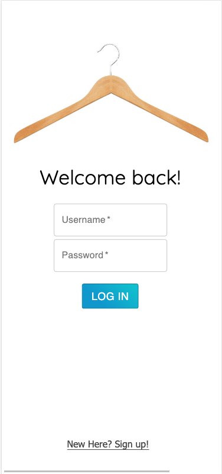
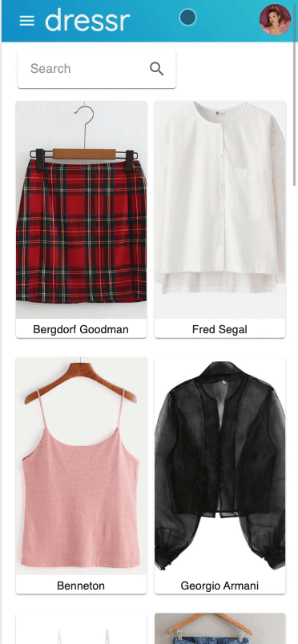
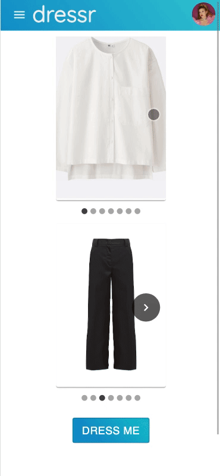

# dressr
_Duration: 10 days_

## Description
- Inspired by the masterpiece film 'Clueless,' dressr is a responsive, full-stack mobile application which allows a user to create their own personalized virtual closet to access at any time. The user can add to their virtual closet, edit an item, search through their wardrobe, and even assistance from the app with pairing an outfit together.

This application uses React, Redux, Express, Passport, and PostgreSQL (a full list of dependencies can be found in `package.json`).

## Prerequisites
Before you get started, make sure you have the following software installed on your computer:

- [Node.js](https://nodejs.org/en/)
- [PostrgeSQL](https://www.postgresql.org/)
- [Nodemon](https://nodemon.io/)

## Create database and table
Create a new database called `dressr` and execute the SQL commands from `database.sql`. You can add your own items or use the starter clothing list provided.

If you would like to name your database something else, you will need to change `dressr` to the name of your new database name in `server/modules/pool.js`

## Development Setup Instructions
- Run `npm install` from the project root directory
- Start postgres if not running already by using `brew services start postgresql`
- Run `npm run server`
- Run `npm run client`
- Navigate to `localhost:3000` in your browser

## Usage
Upon registering or logging in, there are a number of options from which to choose.
Click the Menu icon and select _Add Item_ to add a new item to your closet.
From the Home page, click on any item to be directed to the item's description page to see detailed information about that item. Update the item's last worn date or edit the item description according to your preferences.
Upon clicking the _Dress Me_ link from the Menu icon, you will be directed to a page where you can match an outfit. Click the _Dress Me_ button to randomly populate one top and one bottom from your virtual wardrobe. Choose to randomly select a new top, bottom, or both to suit your preferences.

## Screenshots
Login page:
 

Home page:

Dress Me page:
